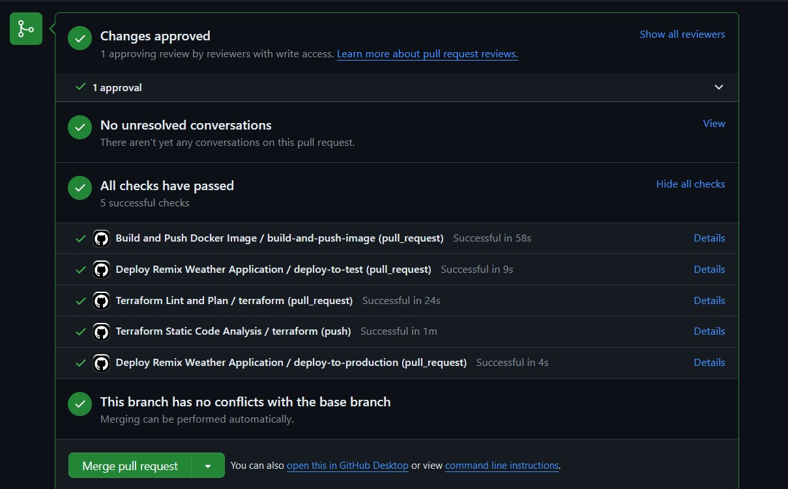

# CST8918-DevOps-Infrastructure-as-Code Final Project
## **Project Description**
This capstone project seamlessly applies Infrastructure as Code (IaC) principles, leveraging Terraform to orchestrate Azure resources for the Remix Weather Application. Through Azure Kubernetes Service (AKS) clusters and managed Redis DB, it enhances scalability and reliability. The Terraform code, organized into modules, establishes a structured approach to resource management, ensuring efficiency and maintainability. GitHub Actions automate workflows, from static code analysis to deployment, streamlining the development process. Collaboration is facilitated through shared repositories and enforced branch protection rules. With Azure Blob Storage serving as the Terraform backend, configuration integrity is assured. By simulating real-world scenarios, this project showcases adeptness in IaC methodologies, delivering resilient and scalable infrastructure seamlessly.

|Student Name | Student number | Student Email| Github Link|
|---|---|---|---|
|Abhishek Dungrani | 041106130| dung0007@algonquinlive.com | https://github.com/dung0007
|Kenan Yusuf | 040653639 | yusu0033@algonquinlive.com | https://github.com/keyusuf
|Thep Rungpholsatit | 041066248 | rung0018@aglonquinlive.com| https://github.com/TheTeeThailand
|Vethuson Amit | 041109985| amit0004@algonquinlive.com| https://github.com/vethusonamitAlgonquin

## **GitHub Actions Workflows Screenshot**
